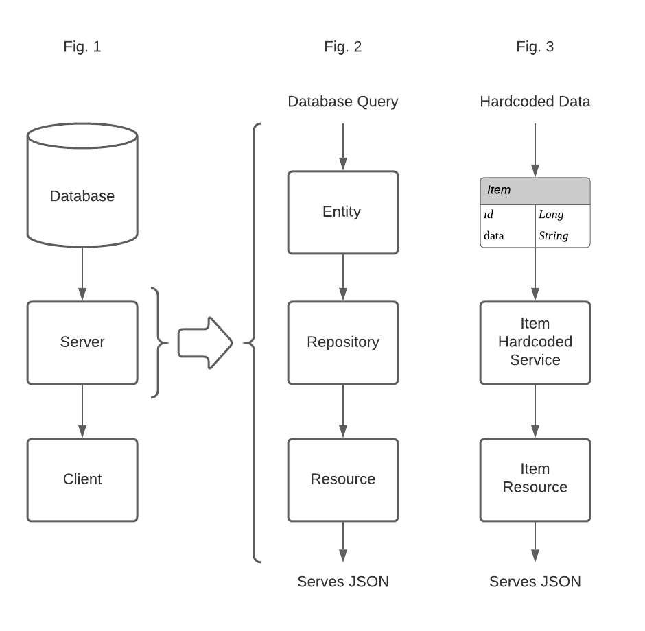

# How Data Flows: The Server 
###### Part 1 of 3

##### This repo is from my Medium series: How Data Flows 

The series is an intro of how data flows from the database to the server and finally to the client. Not even full CRUD. Just a deep dive into READ/Get. 

This section ([Part 1](https://medium.com/@avalojc/how-data-flows-the-server-spring-boot-2ceb73009143)) is specifically geared for the introductory learners or those that are new to Spring-Boot to understand the "*dreaded*" back-end so that it is not so overwhelming.

#### Part 1 
Below I show the basics of how data is being passed and how routes work.

**Fig. 1**: This is an overview of how data flows very generally. From the Database to the Server and then to the Client. Of course, in a full CRUD application, data will flow both ways as it will not only be Read, but also Created, Updated, or Deleted. However as mentioned above this is only an introductory view into the topic and we will focus on Read for now.

**Fig. 2**: This is a focus in on how data flows within the server. When a query is made to the database, the object that returns is parsed by the entity's schema. The resource will invoke the repository which will apply the appropriate method resulting in the resource returning the data as json in the server. This is all a wordy explanation for the data flow here.

**Fig. 3**: This is how we are coding the data in this exercise. We are using hard coded data so that we don't have to worry about creating a database and can focus exclusively on our routes. However, in part three we will implement Postgres.

Checkout [Part 2](https://medium.com/@avalojc/how-data-flows-the-client-react-ef14db2d4361) to see how the client interacts with the server.

And [Part 3](https://medium.com/@avalojc/how-data-flows-putting-it-all-together-4d4571892952) puts it all together and includes a database!

###### I hope you find this helpful and I would love to hear your feedback.

DM me on twitter *@avalocodes* 