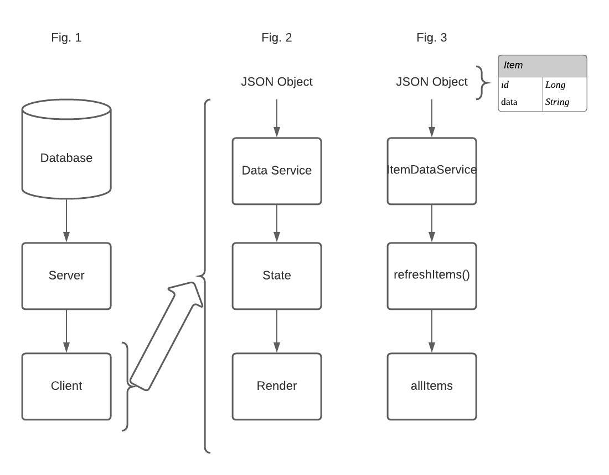

# How Data Flows: The Client 
###### Part 2 of 3

##### This repo is from my Medium series: How Data Flows 

The series is an intro of how data flows from the database to the server and finally to the client. Not even full CRUD. Just a deep dive into READ/Get. 

This section ([Part 2](https://medium.com/@avalojc/how-data-flows-the-client-react-ef14db2d4361)) is specifically geared for the introductory learners or those that are new to developing to understand how data flows from piece to piece

#### Part 2 
Below I show the basics of how data is being passed and how calls work.

**Fig. 1**: This is an overview of how data flows very generally. From the Database to the Server and then to the Client. Of course, in a full CRUD application, data will flow both ways as it will not only be Read, but also Created, Updated, or Deleted. However as mentioned above this is only an introductory view into the topic and we will focus on Read for now.

**Fig. 2**: This is a zoom into how data flows within the Client. This is the data flow you see in this figure: from Data Service, to State, to Rendering. We will dive into how exactly it all the pieces interact over the next few sections. A few important things to note: A data service file does not need to be isolated into its own file. However, I highly recommend it as it makes it easy to use the service methods throughout your application. Another important point to make is that data may not necessarily be rendered. Sometimes it will be, sometimes it won’t. It depends on the needs of your application, but for the sake of this exercise we will be rendering it. When we get to part three we will do a few different things with the data.

**Fig. 3**: This is how we are coding the data in this exercise. Just like in figure two we have three steps. We go from the ItemDataService, to the refreshItems function to set the state, to the allItems function that maps out the data for rendering. In addition the JSON in this diagram has the schema for the data. I kept it simple, just ID and data.

Checkout [Part 1](https://medium.com/@avalojc/how-data-flows-the-server-spring-boot-2ceb73009143) to see how the server serves the data.

And [Part 3](https://medium.com/@avalojc/how-data-flows-putting-it-all-together-4d4571892952) puts it all together and includes a database!

###### I hope you find this helpful and I would love to hear your feedback.

DM me on twitter *@avalocodes* 